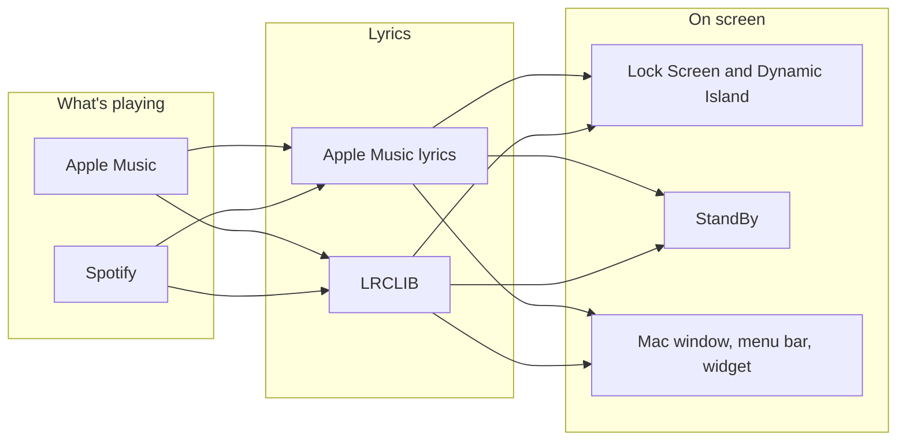

# Lyrics

Synced lyrics for whatever is playing, on the iPhone lock screen and on the Mac.

On iPhone it follows Apple Music or Spotify and puts the current line in a Live Activity: on the Lock Screen, in the Dynamic Island, and full screen in StandBy. On the Mac the same pipeline fills a window, the menu bar, and a desktop widget.

This is a private app. It stays alive in the background and uses Apple Music's own lyrics API, so it is not something App Review would accept.


*StandBy. The line being sung is the big one. The next line sits under it, smaller and dim, and moves up when its turn comes.*

## What you see

**iPhone**

- A now-playing screen in the app, with the lyrics scrolling to the current line.
- Lock Screen and Dynamic Island: the current line and the next one, cross-fading in place.
- StandBy: the same two lines, but the next line scrolls up into place instead of cross-fading.
- On StandBy, the left third of the screen is previous, the middle is play/pause, and the right is next. That works for Apple Music. The first tap on a locked phone still asks for Face ID. That part is iOS, and it can't be turned off.

**Mac**

- The same now-playing window. It can sit above other apps.
- The current line in the menu bar. Closing the window leaves that running.
- A desktop widget in the StandBy style: title on the left, artist on the right, current line large, next line dim. Right-click it to change the size. The type grows with the widget.
- Previous, pause, and next along the bottom of the widget. Pause resumes if the song is already paused. The buttons talk to whichever app is actually playing, Music or Spotify. The first tap asks for Automation permission. That prompt is separate from the one the app itself already got. Tapping the lyrics opens the app.

## Where the lyrics come from

Apple Music's own synced lyrics come first. If those aren't available, [LRCLIB](https://lrclib.net) is next. A synced match from either source beats unsynced text from the other.

Apple Music lyrics use the Apple ID already signed in on the device, from Settings. No separate login. Spotify on the phone, and Spotify playing on another device while you're at the Mac, uses the Web API. You create an app at [developer.spotify.com](https://developer.spotify.com) and add this redirect URI:

```
lyrics-app://spotify-callback
```

On the Mac, the Music app and the Spotify app are read directly, so a song playing on this computer doesn't need that login.



Settings has a timing offset, in steps of a quarter second. Positive values show the line earlier. The Lock Screen, Dynamic Island, and StandBy also run a little ahead of the in-app view, because an update takes a moment to reach the screen. The Mac widget schedules each line early for the same reason.

## Build

You need Xcode. The project file is generated, so change `project.yml` and regenerate rather than editing the Xcode project by hand.

```bash
export DEVELOPER_DIR=/Applications/Xcode.app/Contents/Developer
xcodegen generate

# iPhone. The device has to be plugged in.
xcodebuild -project Lyrics.xcodeproj -scheme Lyrics -destination "id=DEVICE_UDID" \
  -derivedDataPath build -allowProvisioningUpdates build

# Mac
xcodebuild -project Lyrics.xcodeproj -scheme LyricsMac -destination "platform=macOS" \
  -derivedDataPath build/mac -allowProvisioningUpdates build
open build/mac/Build/Products/Debug/Lyrics.app
```

iOS 17 or later, macOS 14 or later. The first launch on the phone asks for Apple Music access. The first launch on the Mac asks to control Music and Spotify.
